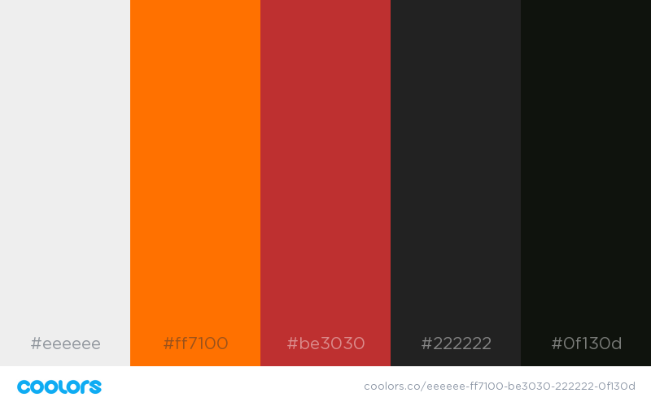
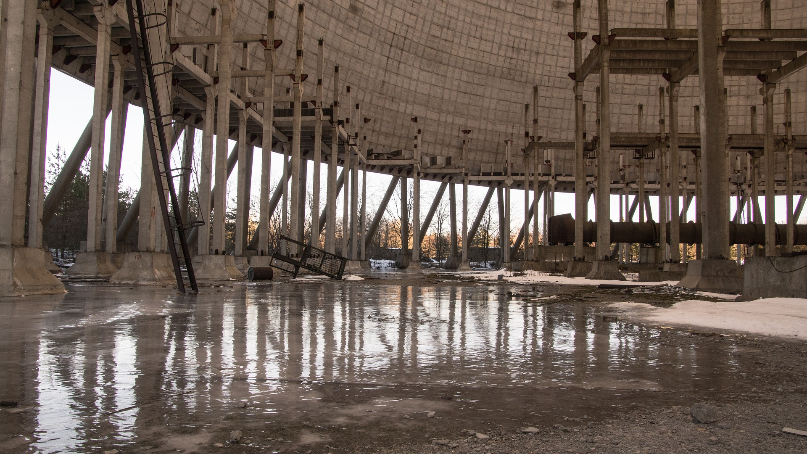
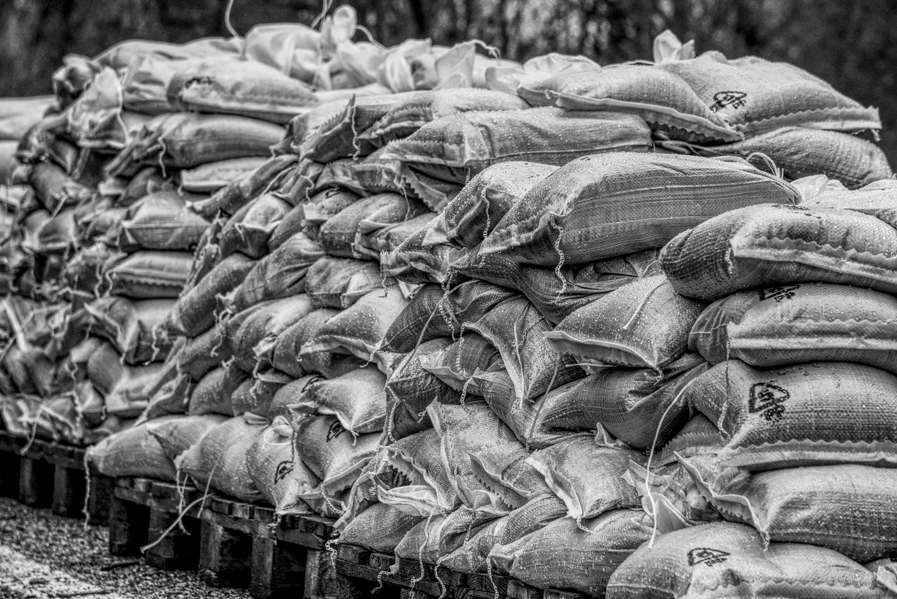

# empreparepercepvis

### Visualizing Emergency Preparedness and Perceptions Across the US

## Interface Sketch

Beginning sketch of main page and subsequent coordinated multi-view pages, each with main question and demographic data to overlay on top of map. Includes notes on color scheme, possible icons, and thoughts on quantifying responses.


## Design Scheme

1. Color Palette

Palette Curtesy of [Color Hunt](http://colorhunt.co/c/118847).<br>
Organized by [Coolors](https://coolors.co/eeeeee-ff7100-be3030-222222-0f130d).

|#EEEEEE|
|#FF7100|
|#BE3030|
|#222222|

<br>


_________


2. Fonts

Curtesy of [Good Fonts - Montserrat](https://fonts.google.com/?query=monte&selection.family=Montserrat)


```
 <!DOCTYPE html>
 <html>
 <head>
      <title>Monteserrat</title>
      <link href="https://fonts.googleapis.com/css?family=Montserrat" rel="stylesheet">
      <style>
          body {
              font-family: 'Montserrat';font-size: 22px;
          }
      </style>
  </head>
  <body>
  <h1>Montserrat</h1>
  <p>Feelings of preparedness, demographics, emergency, disaster management.</p>
  <p>123456790</p>
  <p>ABCDEFGHIJKLMNOPQRSTUVWXYZ</p>
  <p>abcdefghijklmnopqrstuvwxyz</p>
  </body>
  </html>
 ```
_________

3. Web Icons

Home: 
Icon made by Freepik from www.flaticon.com

Search: 
Icon made by Smashicons from www.flaticon.com

Share: 
Icon made by Gregor Cresnar from www.flaticon.com

Data: 
Icon made by Smashicons from www.flaticon.com

Perception: 
Icon made by Eucalyp from www.flaticon.com


_________

4. Multimedia

Possible Images:



Image Uploaded by Taken at https://pixabay.com/



Image Uploaded by Distel2610 at https://pixabay.com/
